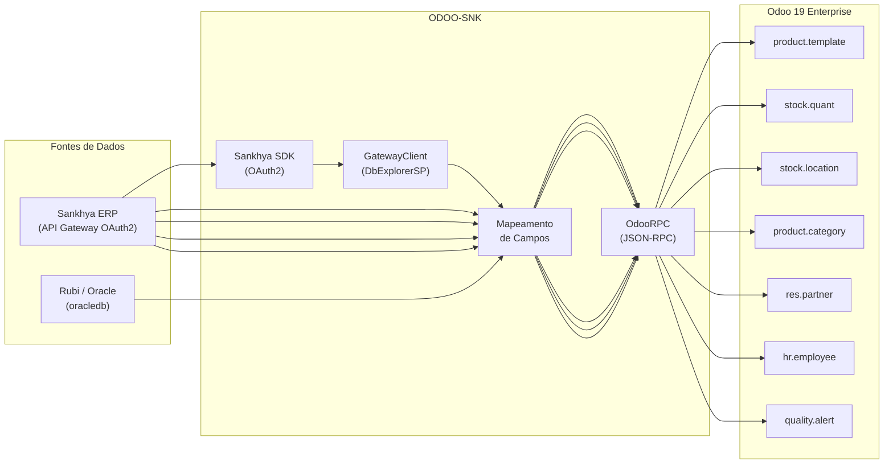

# ODOO-SNK — Integração Sankhya / Rubi → Odoo

Projeto Python para **sincronização de dados entre os ERPs Sankhya e Rubi (Oracle) e o Odoo 19 Enterprise**, utilizando o [Sankhya SDK Python](https://github.com/ssmvictor/Sankhya-SDK-python) (OAuth2), [OdooRPC](https://pypi.org/project/OdooRPC/) e `oracledb`.

> [!IMPORTANT]
> **Objetivo**: Migrar e sincronizar dados (produtos, estoque, parceiros, funcionários, produção) do Sankhya/Rubi para o Odoo, permitindo operação híbrida ou transição gradual entre os sistemas.

---

## Índice

- [Arquitetura](#arquitetura)
- [Estrutura do Projeto](#estrutura-do-projeto)
- [Requisitos](#requisitos)
- [Configuração](#configuração)
- [Módulos de Sincronização](#módulos-de-sincronização)
  - [Produtos](#produtos)
  - [Estoque](#estoque)
  - [Grupos de Produtos](#grupos-de-produtos)
  - [Locais de Estoque](#locais-de-estoque)
  - [Parceiros](#parceiros)
  - [Produção](#produção)
- [Módulos Base](#módulos-base)
- [Como Usar](#como-usar)
- [Solução de Problemas](#solução-de-problemas)
- [Segurança](#segurança)

---

## Arquitetura



### Fluxo Geral de Sincronização

1. **Autenticação** no Sankhya via OAuth2 (client credentials) ou conexão direta ao Oracle
2. **Execução SQL** via `DbExplorerSP.executeQuery` (Sankhya) ou cursor Oracle (Rubi)
3. **Mapeamento** dos campos da origem para os modelos do Odoo
4. **Upsert** no Odoo — cria o registro se não existir ou atualiza o existente

---

## Estrutura do Projeto

```
ODOO-SNK/
├── .env                               # Credenciais (NÃO versionar!)
├── .env.example                       # Modelo de configuração
├── .gitignore
├── README.md
├── requirements.txt                   # Dependências Python
├── inspect_odoo.py                    # Inspeciona modelos/campos do Odoo
├── verificar_modulos_odoo.py          # Lista módulos instalados no Odoo
├── limpar_cache.bat                   # Limpa cache de bytecode Python
│
├── loginOdoo/                         # Módulo de conexão com o Odoo
│   ├── __init__.py
│   └── conexao.py                     # OdooConfig, OdooConexao, criar_conexao()
│
├── loginSNK/                          # Módulo de conexão com o Sankhya
│   ├── __init__.py
│   ├── conexao.py                     # SankhyaConfig, SankhyaConexao (SDK OAuth2)
│   ├── dbexplorer_EXAMPLE.py          # Exemplo de uso do GatewayClient
│   └── sql/
│       ├── produtos.sql               # Query de produtos (TGFPRO)
│       ├── estoque.sql                # Query de saldo de estoque (TGFEST)
│       ├── grupos.sql                 # Query de grupos de produtos (TGFGRU)
│       ├── locais.sql                 # Query de locais de estoque (TGFLOC)
│       ├── parceiros.sql              # Query de parceiros (TGFPAR)
│       ├── parceiros_vendedor.sql     # Query de parceiros filtrada por vendedor
│       └── vendedores.sql             # Query de vendedores
│
├── Produtos/                          # Sincronização de Produtos e Estoque
│   ├── __init__.py
│   ├── sincronizar_produtos.py        # TGFPRO → product.template
│   ├── sincronizar_estoque.py         # TGFEST → stock.quant
│   ├── sincronizar_grupos.py          # TGFGRU → product.category
│   └── sincronizar_locais.py          # TGFLOC → stock.location
│
├── Parceiros/                         # Sincronização de Parceiros
│   ├── __init__.py
│   └── sincronizar_parceiros.py       # TGFPAR → res.partner
│
└── producao/                          # Scripts do setor de Produção/Qualidade
    ├── sync_funcionarios.py           # Rubi (Oracle) → hr.employee
    ├── setup_fundicao.py              # Configuração inicial do setor de Fundição
    ├── registrar_nc.py                # Registro interativo de não conformidades
    ├── registro_diario_nc.py          # Registro em lote de NCs diárias
    ├── criar_alertas_nc.py            # Criação de alertas de qualidade
    ├── limpar_alertas_genericos.py    # Remove alertas genéricos duplicados
    ├── config_bom_massa.py            # Configuração em massa de listas de materiais
    ├── verify_bom.py                  # Verifica integridade das listas de materiais
    ├── verify_sync.py                 # Verifica resultado de sincronizações
    ├── verify_alerts.py               # Verifica alertas de qualidade
    └── sql/                           # Queries SQL para produção
```

---

## Requisitos

- **Python** 3.10+
- **Odoo** 19 Enterprise (SaaS ou on-premise)
- **Sankhya** com API Gateway habilitada
- **Oracle** (opcional, para sincronização de funcionários via Rubi)

### Instalação de Dependências

```bash
pip install -r requirements.txt
```

| Dependência | Uso |
|-------------|-----|
| `python-dotenv` | Carregamento de variáveis de ambiente |
| `requests` | Requisições HTTP |
| `odoorpc` | Comunicação JSON-RPC com Odoo |
| `sankhya-sdk-python` | Autenticação OAuth2 e API Gateway Sankhya |
| `rich` | Saída formatada no terminal (tabelas, progresso) |
| `oracledb` | Conexão com banco Oracle (Rubi) |

---

## Configuração

### 1. Criar arquivo `.env`

```bash
cp .env.example .env
```

### 2. Preencher credenciais

```env
# =============================================
# CONEXÃO ODOO 19
# =============================================
ODOO_URL=https://sua-empresa.odoo.com
ODOO_DB=nome_do_banco
ODOO_EMAIL=seu_email@empresa.com
ODOO_SENHA=sua_senha_segura

# =============================================
# CONEXÃO SANKHYA (OAuth2 via SDK)
# =============================================
# Credenciais obtidas no Portal do Desenvolvedor Sankhya
SANKHYA_CLIENT_ID=seu_client_id
SANKHYA_CLIENT_SECRET=seu_client_secret
SANKHYA_TOKEN=seu_token_proprietario
SANKHYA_AUTH_BASE_URL=https://api.sankhya.com.br

# =============================================
# CONEXÃO ORACLE / RUBI (opcional)
# =============================================
ORACLE_HOST=servidor_oracle
ORACLE_PORT=1521
ORACLE_SERVICE_NAME=nome_do_servico
ORACLE_USER=usuario_oracle
ORACLE_PASSWORD=senha_oracle
```

> [!CAUTION]
> **Nunca versione o arquivo `.env`** com credenciais reais. Use `.env.example` como modelo.

---

## Módulos de Sincronização

### Produtos

**Arquivo:** `Produtos/sincronizar_produtos.py`

Sincroniza produtos ativos do Sankhya (`TGFPRO`) para o modelo `product.template` do Odoo.

**Mapeamento de campos:**

| TGFPRO (Sankhya) | product.template (Odoo) | Descrição |
|-------------------|------------------------|-----------|
| `CODPROD` | `default_code` | Código interno (chave do upsert) |
| `DESCRPROD` | `name` | Nome do produto |
| `REFFORN` | `barcode` | Referência do fornecedor |
| `PESOBRUTO` | `weight` | Peso bruto |
| `CODVOL` | `uom_id` / `uom_po_id` | Unidade de medida |
| `USOPROD` | `type` / `is_storable` | `R` → `consu` (estocável), `S` → `service` |
| `NCM` | `ncm` / `l10n_br_ncm_id` | NCM fiscal (se campo disponível) |
| `MARCA` | `product_brand_id` / `x_marca` | Marca (se campo disponível) |
| `CODLOCALPADRAO` | `x_local_padrao_id` | Local padrão de estoque (se campo disponível) |
| — | `list_price` | Fixo: `0.0` (preço definido por tabela de preços) |
| — | `sale_ok` | Fixo: `False` |
| — | `purchase_ok` | Fixo: `True` |

**Lógica de upsert:**
- Busca pelo `default_code` (CODPROD)
- Se não existir: **cria** o produto
- Se existir: **atualiza** nome, peso, barcode, unidade e campos complementares

```bash
python Produtos/sincronizar_produtos.py
```

---

### Estoque

**Arquivo:** `Produtos/sincronizar_estoque.py`

Sincroniza saldos de estoque do Sankhya (`TGFEST`) para o modelo `stock.quant` do Odoo.

> [!WARNING]
> Requer que os produtos (`sincronizar_produtos.py`) e os locais (`sincronizar_locais.py`) já estejam sincronizados no Odoo.

**Mapeamento de campos:**

| TGFEST (Sankhya) | stock.quant (Odoo) | Descrição |
|------------------|-------------------|-----------|
| `CODPROD` | `product_id` | Produto (via `default_code`) |
| `CODLOCAL` | `location_id` | Local de estoque (via `barcode`) |
| `ESTOQUE` | `inventory_quantity` | Quantidade em estoque |

**Comportamento:**
- Pré-carrega mapa de produtos em cache para performance
- Aplica `action_apply_inventory` após cada ajuste
- Itens sem produto ou local correspondente no Odoo são ignorados (contados como "ignorados")

```bash
python Produtos/sincronizar_estoque.py
```

---

### Grupos de Produtos

**Arquivo:** `Produtos/sincronizar_grupos.py`

Sincroniza a estrutura de grupos de produtos do Sankhya (`TGFGRU`) para `product.category` no Odoo, preservando hierarquia pai/filho em dois passos.

**Mapeamento de campos:**

| TGFGRU (Sankhya) | product.category (Odoo) | Descrição |
|------------------|------------------------|-----------|
| `CODGRUPOPROD` | `name` (prefixo `[COD]`) | Código do grupo |
| `DESCRGRUPOPROD` | `name` | Descrição do grupo |
| `CODGRUPAI` | `parent_id` | Código do grupo pai |
| `GRAU` | `x_grau` (se disponível) | Nível hierárquico |

**Etapas de sincronização:**
1. **Passo A** — Cria ou atualiza todas as categorias sem vincular `parent_id`
2. **Passo B** — Reconcilia a hierarquia, definindo `parent_id` para cada categoria

```bash
python Produtos/sincronizar_grupos.py
```

---

### Locais de Estoque

**Arquivo:** `Produtos/sincronizar_locais.py`

Sincroniza os locais de estoque do Sankhya (`TGFLOC`) para `stock.location` no Odoo, respeitando hierarquia pai/filho.

**Mapeamento de campos:**

| TGFLOC (Sankhya) | stock.location (Odoo) | Descrição |
|------------------|----------------------|-----------|
| `CODLOCAL` | `barcode` | Código do local (chave do upsert) |
| `DESCRLOCAL` | `name` | Descrição do local |
| `CODLOCALPAI` | `location_id` | Local pai na hierarquia |
| `GRAU` | `x_grau` (se disponível) | Nível hierárquico |
| — | `usage` | Fixo: `internal` |

**Etapas de sincronização:**
1. Locais são ordenados pelo grau hierárquico antes do processamento
2. **Passo A** — Cria ou atualiza todos os locais com `location_id` apontando para o depósito padrão
3. **Passo B** — Reconcilia a hierarquia real, vinculando `location_id` ao pai correto

```bash
python Produtos/sincronizar_locais.py
```

---

### Parceiros

**Arquivo:** `Parceiros/sincronizar_parceiros.py`

Sincroniza parceiros (clientes, fornecedores, transportadoras, etc.) do Sankhya (`TGFPAR`) para `res.partner` no Odoo.

**Mapeamento principal de campos:**

| TGFPAR (Sankhya) | res.partner (Odoo) | Descrição |
|------------------|--------------------|-----------|
| `CODPARC` | `ref` / `x_sankhya_id` | Código do parceiro (chave do upsert) |
| `RAZAOSOCIAL` | `name` | Razão social |
| `NOMEPARC` | `name` (fallback) | Nome do parceiro |
| `TIPPESSOA` | `company_type` / `is_company` | `J`/`E` → empresa, `F` → pessoa física |
| `CGC_CPF` | `vat` / `l10n_br_cnpj_cpf` | CNPJ ou CPF |
| `INSCESTADNAUF` | `l10n_br_ie_code` / `x_ie` | Inscrição estadual |
| `NOMEEND` + `NUMEND` | `street` | Logradouro e número |
| `COMPLEMENTO` / `NOMEBAI` | `street2` | Complemento ou bairro |
| `NOMECID` | `city` | Cidade |
| `CEP` | `zip` | CEP |
| `UF_SIGLA` | `state_id` | Estado (via código IBGE) |
| `PAIS_SIGLA` | `country_id` | País (via código ISO) |
| `EMAIL` | `email` | E-mail |
| `TELEFONE` | `phone` | Telefone |
| `FAX` | `mobile` | Celular |
| `CLIENTE` | `customer_rank` | Flag de cliente |
| `FORNECEDOR` | `supplier_rank` | Flag de fornecedor |
| `ATIVO` | `active` | Status ativo/inativo |

**Papéis mapeados como tags (`category_id`):** `CLIENTE`, `FORNECEDOR`, `VENDEDOR`, `TRANSPORTADORA`, `MOTORISTA`

```bash
python Parceiros/sincronizar_parceiros.py
```

---

### Produção

Conjunto de scripts para o setor de produção, localizados em `producao/`.

#### Funcionários (`sync_funcionarios.py`)

Sincroniza funcionários do sistema Rubi (banco Oracle) para `hr.employee` no Odoo.

**Origem:** tabelas `VETORH.R034FUN`, `VETORH.R038HCC`, `VETORH.R018CCU`, `VETORH.R024CAR`

| Campo Rubi | hr.employee (Odoo) | Descrição |
|------------|--------------------|-----------|
| `NUMCAD` | `barcode` | Número de crachá (chave do upsert) |
| `NOMFUN` | `name` | Nome do funcionário |
| `TITCAR` | `job_title` | Cargo |
| `NOMCCU` | `department_id` | Departamento (criado se não existir) |
| `SITAFA` | `active` | `7` → arquivado, demais → ativo |

```bash
python producao/sync_funcionarios.py
```

#### Setup Fundição (`setup_fundicao.py`)

Configura o setor de Fundição no Odoo: verifica/cria o departamento, lista fundidores, cadastra motivos de não conformidade (`quality.reason`) e cria equipe de qualidade (`quality.alert.team`).

```bash
python producao/setup_fundicao.py
```

#### Registrar Não Conformidade (`registrar_nc.py`)

Registra alertas de qualidade (`quality.alert`) para o setor de Fundição de forma interativa ou via argumentos de linha de comando.

```bash
# Modo interativo
python producao/registrar_nc.py

# Modo direto
python producao/registrar_nc.py --titulo "Bolhas na peça X" --motivo "Bolhas" --prioridade 2
```

---

## Módulos Base

### loginOdoo — Conexão com o Odoo

Gerencia autenticação e comunicação com o Odoo via JSON-RPC (OdooRPC).

```python
from loginOdoo.conexao import criar_conexao

# Cria conexão já autenticada (lê credenciais do .env)
conexao = criar_conexao()

# Buscar registros
parceiros = conexao.search_read('res.partner', campos=['name', 'email'], limite=10)

# Criar registro
produto_id = conexao.criar('product.template', {'name': 'Produto X', 'type': 'consu'})

# Atualizar registro
conexao.atualizar('product.template', produto_id, {'list_price': 99.90})

# Excluir registro
conexao.excluir('product.template', produto_id)
```

**Classes e funções principais:**

| Classe / Função | Descrição |
|----------------|-----------|
| `OdooConfig` | Dataclass com credenciais de conexão |
| `OdooConexao` | Gerencia conexão e operações CRUD |
| `carregar_configuracao()` | Lê credenciais do `.env` |
| `criar_conexao()` | Cria e retorna conexão já autenticada |
| `OdooConfigError` | Exceção: variáveis de ambiente ausentes |
| `OdooConnectionError` | Exceção: falha na conexão |

```bash
# Testar conexão
python loginOdoo/conexao.py
```

---

### loginSNK — Conexão com o Sankhya

Gerencia autenticação OAuth2 na API Sankhya via SDK.

```python
from loginSNK.conexao import criar_conexao_sankhya

# Cria conexão já autenticada (lê credenciais do .env)
conexao = criar_conexao_sankhya()

# Sessão autenticada com auto-refresh de token
session = conexao.session

# Headers para requisições manuais
headers = conexao.obter_headers_autorizacao()
```

**Classes e funções principais:**

| Classe / Função | Descrição |
|----------------|-----------|
| `SankhyaConfig` | Dataclass com credenciais OAuth2 |
| `SankhyaConexao` | Gerencia autenticação e sessão |
| `carregar_configuracao_sankhya()` | Lê credenciais do `.env` |
| `criar_conexao_sankhya()` | Cria e retorna conexão já autenticada |
| `SankhyaConfigError` | Exceção: variáveis de ambiente ausentes |
| `SankhyaAuthError` | Exceção: falha na autenticação OAuth2 |

```bash
# Testar conexão
python loginSNK/conexao.py
```

---

## Como Usar

### Instalação rápida

```bash
git clone <repositorio>
cd ODOO-SNK
pip install -r requirements.txt
cp .env.example .env
# Edite .env com suas credenciais
```

### Ordem recomendada de execução

Para uma carga inicial completa, execute nesta ordem:

```bash
# 1. Grupos de produtos (categorias)
python Produtos/sincronizar_grupos.py

# 2. Locais de estoque
python Produtos/sincronizar_locais.py

# 3. Produtos (depende de grupos e locais para campos complementares)
python Produtos/sincronizar_produtos.py

# 4. Estoque (depende de produtos e locais)
python Produtos/sincronizar_estoque.py

# 5. Parceiros
python Parceiros/sincronizar_parceiros.py

# 6. Funcionários (requer conexão Oracle configurada)
python producao/sync_funcionarios.py
```

### Personalizar queries SQL

As queries SQL ficam em `loginSNK/sql/`. Edite conforme necessário:

```sql
-- loginSNK/sql/produtos.sql
SELECT
    PRO.CODPROD,
    PRO.DESCRPROD,
    PRO.PESOBRUTO,
    PRO.REFFORN,
    PRO.CODVOL,
    PRO.USOPROD
FROM TGFPRO PRO
WHERE PRO.ATIVO = 'S'
```

---

## Modelos do Odoo Utilizados

| Modelo | Descrição |
|--------|-----------|
| `product.template` | Templates de produtos |
| `product.product` | Variantes de produtos |
| `product.category` | Categorias / grupos de produtos |
| `uom.uom` | Unidades de medida |
| `stock.quant` | Saldos de estoque |
| `stock.location` | Locais de estoque |
| `stock.warehouse` | Depósitos |
| `res.partner` | Clientes / Fornecedores / Parceiros |
| `res.country` | Países |
| `res.country.state` | Estados |
| `hr.employee` | Funcionários |
| `hr.department` | Departamentos |
| `quality.alert` | Alertas de qualidade / Não conformidades |
| `quality.alert.team` | Equipes de qualidade |
| `quality.reason` | Motivos de não conformidade |
| `ir.module.module` | Módulos instalados |

### Tipos de Produto (Odoo 19 API)

| Valor API | Label na UI | is_storable | Descrição |
|-----------|-------------|-------------|-----------|
| `consu` | Mercadorias | `True` | Bens tangíveis com controle de estoque |
| `service` | Serviço | `False` | Ofertas intangíveis sem estoque |
| `combo` | Combo | — | Mix de bens e serviços |

---

## Solução de Problemas

| Erro | Solução |
|------|---------|
| `ModuleNotFoundError: odoorpc` | `pip install odoorpc` |
| `ModuleNotFoundError: sankhya_sdk` | `pip install -r requirements.txt` |
| `SANKHYA_CLIENT_ID não configurado` | Preencha o `.env` com as credenciais |
| `Access Denied` (Odoo) | Verifique `ODOO_EMAIL` e `ODOO_SENHA` |
| `database does not exist` | Verifique `ODOO_DB` |
| `Wrong value for type` | Use `consu`, `service` ou `combo` |
| `Connection refused` | Verifique se o servidor está acessível |
| `Arquivo SQL não encontrado` | Verifique o caminho em `loginSNK/sql/` |
| `Credenciais Sankhya não encontradas` | Verifique `SANKHYA_CLIENT_ID` e `SANKHYA_CLIENT_SECRET` no `.env` |
| `Missing Oracle environment variables` | Configure `ORACLE_HOST`, `ORACLE_PORT`, `ORACLE_SERVICE_NAME`, etc. no `.env` |
| `Não foi possível localizar stock.warehouse` | Verifique se o Odoo possui ao menos um depósito configurado |
| `action_apply_inventory` falhou | O Odoo pode usar `apply_inventory` — o script tenta automaticamente o fallback |

---

## Segurança

- **Nunca versione** o `.env` com credenciais reais
- Use `.env.example` como modelo para novos ambientes
- Prefira HTTPS em produção
- Todos os scripts validam variáveis obrigatórias antes de executar

---

## Licença

Projeto de uso interno — Grupo AEL.

---

**Atualizado em:** 19/02/2026
