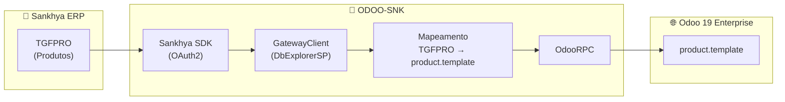

# 🔗 ODOO-SNK — Integração Sankhya → Odoo

Projeto Python para **sincronização de dados entre o ERP Sankhya e Odoo 19 Enterprise**, utilizando o [Sankhya SDK Python](https://github.com/ssmvictor/Sankhya-SDK-python) (OAuth2) e [OdooRPC](https://pypi.org/project/OdooRPC/).

> [!IMPORTANT]
> **Objetivo**: Migrar/sincronizar dados do Sankhya para o Odoo, permitindo operação híbrida ou transição gradual entre os sistemas.

---

## 📋 Índice

- [Arquitetura](#-arquitetura)
- [Estrutura do Projeto](#-estrutura-do-projeto)
- [Requisitos](#️-requisitos)
- [Configuração](#-configuração)
- [Sincronização de Produtos](#-sincronização-de-produtos)
- [Módulos](#-módulos)
- [Como Usar](#-como-usar)
- [Solução de Problemas](#-solução-de-problemas)

---

## 🏗️ Arquitetura



### Fluxo de Sincronização

1. **Autenticação** no Sankhya via OAuth2 (client credentials)
2. **Execução SQL** via `DbExplorerSP.executeQuery` lendo `produtos.sql`
3. **Mapeamento** dos campos TGFPRO → `product.template`
4. **Upsert** no Odoo — cria produto novo ou atualiza existente (por `default_code`)

---

## 📁 Estrutura do Projeto

```
ODOO-SNK/
├── .env                          # Credenciais (NÃO versionar!)
├── .env.example                  # Modelo de configuração
├── .gitignore
├── README.md
├── requirements.txt              # Dependências Python
│
├── verificar_modulos_odoo.py     # Lista módulos instalados no Odoo
│
├── loginOdoo/                    # Módulo de conexão Odoo
│   ├── __init__.py
│   └── conexao.py                # OdooConfig, OdooConexao, criar_conexao()
│
├── loginSNK/                     # Módulo de conexão Sankhya
│   ├── __init__.py
│   ├── conexao.py                # SankhyaConfig, SankhyaConexao (SDK OAuth2)
│   ├── dbexplorer_EXAMPLE.py     # Exemplo de uso do GatewayClient
│   └── sql/
│       └── produtos.sql          # Query SQL para buscar produtos
│
└── Produtos/                     # Sincronização de Produtos
    ├── __init__.py
    └── sincronizar_produtos.py   # 🔄 Script principal de sincronização
```

---

## ⚙️ Requisitos

- **Python** 3.10+
- **Odoo** 19 Enterprise (SaaS ou on-premise)
- **Sankhya** com API Gateway habilitada

### Instalação de Dependências

```bash
pip install -r requirements.txt
```

| Dependência | Uso |
|-------------|-----|
| `python-dotenv` | Carregamento de variáveis de ambiente |
| `requests` | Requisições HTTP |
| `odoorpc` | Comunicação XML-RPC com Odoo |
| `sankhya-sdk-python` | Autenticação OAuth2 e API Gateway Sankhya |

---

## 🔧 Configuração

### 1. Criar arquivo `.env`

```bash
cp .env.example .env
```

### 2. Preencher credenciais

```env
# =============================================
# CONEXÃO ODOO 19
# =============================================
ODOO_URL=https://sua-empresa.odoo.com
ODOO_DB=nome_do_banco
ODOO_EMAIL=seu_email@empresa.com
ODOO_SENHA=sua_senha_segura

# =============================================
# CONEXÃO SANKHYA (OAuth2 via SDK)
# =============================================
# Credenciais obtidas no Portal do Desenvolvedor Sankhya
SANKHYA_CLIENT_ID=seu_client_id
SANKHYA_CLIENT_SECRET=seu_client_secret
SANKHYA_TOKEN=seu_token_proprietario
```

> [!CAUTION]
> **Nunca versione o arquivo `.env`** com credenciais reais. Use `.env.example` como modelo.

---

## 🔄 Sincronização de Produtos

### Executar

```bash
python -m Produtos.sincronizar_produtos
```

### O que faz

| Etapa | Descrição |
|-------|-----------|
| **[1/4]** | Conecta ao Sankhya via OAuth2 |
| **[2/4]** | Carrega e executa `loginSNK/sql/produtos.sql` |
| **[3/4]** | Conecta ao Odoo via OdooRPC |
| **[4/4]** | Cria ou atualiza produtos no Odoo |

### Mapeamento de Campos

| TGFPRO (Sankhya) | product.template (Odoo) | Descrição |
|-------------------|------------------------|-----------|
| `CODPROD` | `default_code` | Código interno (chave do upsert) |
| `DESCRPROD` | `name` | Nome do produto |
| `VLRVENDA` | `list_price` | Preço de venda |
| `REFFORN` | `barcode` | Código de barras |
| `PESOBRUTO` | `weight` | Peso bruto |
| — | `type` | Fixo: `consu` (Mercadorias) |
| — | `sale_ok` | Fixo: `True` |
| — | `purchase_ok` | Fixo: `True` |

### Lógica de Upsert

- **Produto novo** (não existe no Odoo pelo `default_code`): **cria**
- **Produto existente**: **atualiza** nome, preço, peso, barcode

### Personalizar a Query SQL

Edite o arquivo `loginSNK/sql/produtos.sql`:

```sql
SELECT * FROM TGFPRO PRO
  WHERE PRO.ATIVO = 'S'
  AND PRO.CODPROD = 210000
```

---

## 📦 Módulos

### loginOdoo — Conexão Odoo

```python
from loginOdoo.conexao import criar_conexao

conexao = criar_conexao()
parceiros = conexao.search_read('res.partner', campos=['name', 'email'])
```

### loginSNK — Conexão Sankhya (OAuth2)

```python
from loginSNK.conexao import criar_conexao_sankhya

conexao = criar_conexao_sankhya()
session = conexao.session  # SankhyaSession autenticada
```

### Produtos — CRUD Odoo

```python
from loginOdoo.conexao import criar_conexao
from Produtos.odoo_produtos_api import ProdutoService

conexao = criar_conexao()
svc = ProdutoService(conexao)

# Listar
produtos = svc.listar(limite=50)

# Criar
produto_id = svc.criar(nome="Produto X", codigo="PROD-001", preco=99.90)

# Atualizar
svc.atualizar(produto_id, {'list_price': 149.90})
```

---

## 🚀 Como Usar

### Instalação rápida

```bash
git clone <repositorio>
cd ODOO-SNK
pip install -r requirements.txt
cp .env.example .env
# Edite .env com suas credenciais
```

### Testar conexões

```bash
# Testar Odoo
python loginOdoo/conexao.py

# Testar Sankhya
python loginSNK/conexao.py
```

### Sincronizar produtos

```bash
python -m Produtos.sincronizar_produtos
```

---

## 📝 Modelos do Odoo 19

| Modelo | Descrição |
|--------|-----------|
| `product.template` | Templates de produtos |
| `product.product` | Variantes de produtos |
| `product.category` | Categorias |
| `res.partner` | Clientes/Fornecedores |
| `ir.module.module` | Módulos instalados |

### Tipos de Produto (Odoo 19 API)

| Valor API | Label na UI | Descrição |
|-----------|-------------|-----------|
| `consu` | Mercadorias | Bens tangíveis |
| `service` | Serviço | Ofertas intangíveis |
| `combo` | Combo | Mix de bens e serviços |

---

## 🆘 Solução de Problemas

| Erro | Solução |
|------|---------|
| `ModuleNotFoundError: odoorpc` | `pip install odoorpc` |
| `ModuleNotFoundError: sankhya_sdk` | `pip install -r requirements.txt` |
| `SANKHYA_CLIENT_ID não configurado` | Preencha o `.env` com as credenciais |
| `Access Denied` (Odoo) | Verifique `ODOO_EMAIL` e `ODOO_SENHA` |
| `database does not exist` | Verifique `ODOO_DB` |
| `Wrong value for type` | Use `consu`, `service` ou `combo` |
| `Connection refused` | Verifique se o servidor está acessível |

---

## 🔒 Segurança

- ⚠️ **Nunca versione** o `.env` com credenciais reais
- 🔐 Use `.env.example` como modelo
- 🌐 Prefira HTTPS em produção
- ✅ Todos os scripts validam variáveis obrigatórias

---

## 📄 Licença

Projeto de uso interno — Grupo AEL.

---

**Atualizado em:** 16/02/2026
