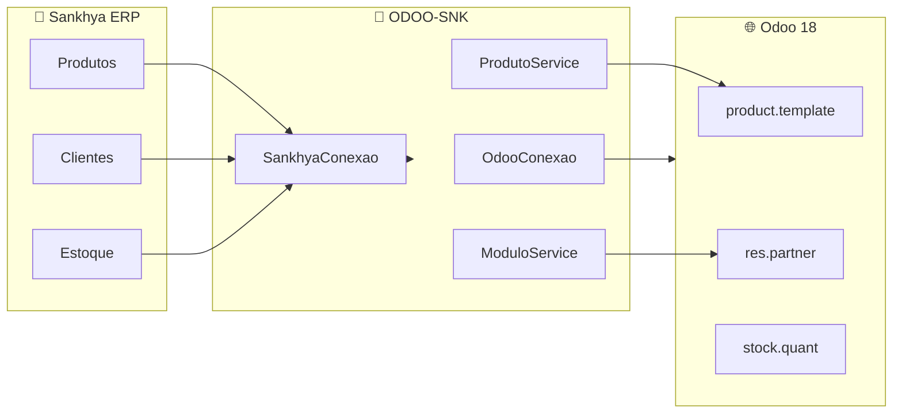
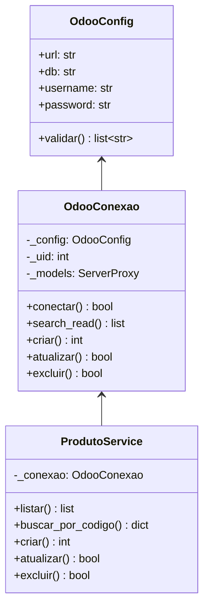

# 🔗 ODOO-SNK - Integração Sankhya → Odoo 18

Este projeto fornece uma arquitetura Python para **integração entre o ERP Sankhya e Odoo 18 Community** via APIs, utilizando boas práticas de programação como **OOP**, **tipagem estática** e **código limpo**.

> [!IMPORTANT]
> **Objetivo Principal**: Migrar/sincronizar dados do Sankhya para o Odoo 18, permitindo uma transição gradual entre os sistemas ou operação híbrida.

---

## 📋 Índice

- [Visão Geral](#-visão-geral)
- [Arquitetura do Projeto](#-arquitetura-do-projeto)
- [Boas Práticas Utilizadas](#-boas-práticas-utilizadas)
- [Estrutura do Projeto](#-estrutura-do-projeto)
- [Requisitos](#️-requisitos)
- [Configuração](#-configuração)
- [Módulos](#-módulos)
- [Como Usar](#-como-usar)

---

## 📖 Visão Geral

### Propósito da Integração

A intenção deste projeto é criar uma **integração robusta entre o ERP Sankhya e o Odoo 18**, permitindo:

- 🔄 **Sincronização de Produtos** - Migrar catálogo de produtos do Sankhya para Odoo
- 👥 **Sincronização de Clientes/Fornecedores** - Manter parceiros atualizados
- 📦 **Sincronização de Estoque** - Controle de inventário unificado
- 📄 **Sincronização de Pedidos** - Fluxo de vendas integrado

### Diagrama de Integração



### Módulos Disponíveis

| Módulo | Classe Principal | Descrição |
|--------|------------------|-----------|
| **loginOdoo** | `OdooConexao` | Conexão XML-RPC/JSON-RPC com Odoo |
| **loginSNK** | `SankhyaConexao` | Autenticação REST API Sankhya |
| **Produtos** | `ProdutoService` | CRUD de produtos no Odoo |
| **verificar_modulos** | `ModuloService` | Lista módulos instalados |

---

## 🏗️ Arquitetura do Projeto

### Padrões de Design Utilizados



---

## ✨ Boas Práticas Utilizadas

Este projeto segue as melhores práticas de desenvolvimento Python:

### 1. Programação Orientada a Objetos (OOP)

```python
# ✅ Classes bem definidas com responsabilidade única
class ProdutoService:
    """Serviço para operações CRUD em produtos."""
    
    def __init__(self, conexao: OdooConexao) -> None:
        self._conexao = conexao
```

### 2. Tipagem Estática (Type Hints)

```python
# ✅ Todos os métodos possuem anotações de tipo
def buscar_por_codigo(self, codigo: str) -> Optional[dict[str, Any]]:
    """Busca produto pelo código interno."""
    ...
```

### 3. Dataclasses para Configuração

```python
# ✅ Configurações tipadas e imutáveis
@dataclass
class OdooConfig:
    url: str
    db: str
    username: str
    password: str
```

### 4. Princípios SOLID

| Princípio | Aplicação |
|-----------|-----------|
| **S**ingle Responsibility | Cada classe tem uma única responsabilidade |
| **O**pen/Closed | Classes abertas para extensão, fechadas para modificação |
| **D**ependency Inversion | Services dependem de abstrações (conexões) |

### 5. Padrões Recomendados

| Padrão | Descrição | Exemplo |
|--------|-----------|---------|
| **Repository Pattern** | Abstração de acesso a dados | `ProdutoService` |
| **Factory Functions** | Funções utilitárias de criação | `criar_conexao()` |
| **Configuration Object** | Configuração encapsulada | `OdooConfig` |

### 6. Documentação

```python
# ✅ Docstrings completas com Args e Returns
def criar(self, nome: str, codigo: str, preco: float) -> Optional[int]:
    """Cria novo produto no Odoo.
    
    Args:
        nome: Nome do produto.
        codigo: Código interno (default_code).
        preco: Preço de venda.
        
    Returns:
        ID do produto criado ou None se já existir.
    """
```

---

## 📁 Estrutura do Projeto

```
ODOO-SNK/
├── .env                        # Credenciais (não versionar!)
├── .env.example                # Modelo de configuração
├── .gitignore
├── README.md                   # Este arquivo
├── requirements.txt            # Dependências Python
├── verificar_modulos_odoo.py   # Lista módulos do Odoo
│
├── loginOdoo/                  # Conexão Odoo
│   └── conexao.py              # OdooConfig, OdooConexao
│
├── loginSNK/                   # Conexão Sankhya
│   ├── conexao.py              # SankhyaConfig, SankhyaConexao
│   └── bearer_token.txt        # Token gerado (não versionar!)
│
└── Produtos/                   # API de Produtos Odoo
    ├── README.md               # Documentação detalhada
    └── odoo_produtos_api.py    # ProdutoService, CategoriaService
```

---

## ⚙️ Requisitos

```bash
pip install -r requirements.txt
```

**Dependências:**
- `python-dotenv>=1.0.0` - Carregamento de variáveis de ambiente
- `requests>=2.31.0` - Requisições HTTP (Sankhya)

**Python:** 3.10+ (necessário para tipagem moderna)

---

## 🔧 Configuração

### 1. Criar arquivo `.env`

```bash
cp .env.example .env
```

### 2. Configurar credenciais

```env
# =============================================
# CONEXÃO ODOO 18
# =============================================
ODOO_URL=http://192.168.1.47:8081
ODOO_DB=odoo_producao
ODOO_EMAIL=seu_email@empresa.com
ODOO_SENHA=sua_senha_segura

# =============================================
# CONEXÃO SANKHYA
# =============================================
SANKHYA_APPKEY=sua_appkey_aqui
SANKHYA_TOKEN=seu_token_aqui
SANKHYA_USERNAME=seu_usuario
SANKHYA_PASSWORD=sua_senha_segura
```

### Servidores

| Sistema | URL | Porta |
|---------|-----|-------|
| Odoo 18 | `http://192.168.1.47` | 8081 |
| Sankhya | `https://api.sankhya.com.br` | 443 |

---

## 📦 Módulos

### 1. loginOdoo - Conexão Odoo

Classes para conexão com Odoo via XML-RPC e JSON-RPC.

```bash
python loginOdoo/conexao.py
```

**Uso programático:**
```python
from loginOdoo.conexao import criar_conexao

# Cria conexão autenticada automaticamente
conexao = criar_conexao()

# Buscar registros
parceiros = conexao.search_read('res.partner', campos=['name', 'email'])
```

---

### 2. loginSNK - Conexão Sankhya

Classes para autenticação na API REST Sankhya.

```bash
python loginSNK/conexao.py
```

**Uso programático:**
```python
from loginSNK.conexao import criar_conexao_sankhya

# Autentica e obtém token
conexao = criar_conexao_sankhya()

# Headers prontos para requisições
headers = conexao.obter_headers_autorizacao()
```

---

### 3. Produtos - CRUD Odoo

Serviço completo para gerenciamento de produtos.

```bash
python Produtos/odoo_produtos_api.py
```

**Uso programático:**
```python
from loginOdoo.conexao import criar_conexao
from Produtos.odoo_produtos_api import ProdutoService

conexao = criar_conexao()
produto_service = ProdutoService(conexao)

# Listar produtos
produtos = produto_service.listar(limite=50)

# Criar produto
produto_id = produto_service.criar(
    nome="Novo Produto",
    codigo="PROD-001",
    preco=99.90
)

# Atualizar
produto_service.atualizar(produto_id, {'list_price': 149.90})
```

---

### 4. verificar_modulos - Módulos Odoo

Serviço para listar módulos instalados.

```bash
python verificar_modulos_odoo.py
```

**Uso programático:**
```python
from loginOdoo.conexao import criar_conexao
from verificar_modulos_odoo import ModuloService

conexao = criar_conexao()
modulo_service = ModuloService(conexao)

# Listar instalados
modulo_service.listar_instalados()

# Verificar específicos
modulo_service.verificar_modulos(['product', 'sale', 'stock'])
```

---

## 🚀 Como Usar

### 1. Instalação

```bash
git clone <repositorio>
cd ODOO-SNK
pip install -r requirements.txt
cp .env.example .env
# Edite .env com suas credenciais
```

### 2. Testar conexões

```bash
# Testar Odoo
python loginOdoo/conexao.py

# Testar Sankhya
python loginSNK/conexao.py
```

### 3. Exemplo de integração

```python
from loginOdoo.conexao import criar_conexao
from loginSNK.conexao import criar_conexao_sankhya
from Produtos.odoo_produtos_api import ProdutoService

# Conectar aos dois sistemas
odoo = criar_conexao()
sankhya = criar_conexao_sankhya()

# Serviço de produtos
produto_service = ProdutoService(odoo)

# TODO: Implementar sincronização Sankhya → Odoo
```

---

## 🔒 Segurança

- ⚠️ **Nunca versione arquivos `.env`** com credenciais reais
- 🔐 Use `.env.example` como modelo (sem credenciais)
- 🌐 Prefira HTTPS em ambientes de produção
- ✅ Todos os scripts validam variáveis obrigatórias

---

## 📝 Modelos do Odoo

| Modelo | Descrição |
|--------|-----------|
| `product.template` | Templates de produtos |
| `product.product` | Variantes de produtos |
| `product.category` | Categorias |
| `res.partner` | Clientes/Fornecedores |
| `ir.module.module` | Módulos instalados |

---

## 🆘 Solução de Problemas

| Erro | Solução |
|------|---------|
| `Variáveis não configuradas` | Configure o arquivo `.env` |
| `database does not exist` | Verifique `ODOO_DB` |
| `Access Denied` | Verifique credenciais Odoo |
| `Connection refused` | Verifique se o servidor está rodando |
| Token Sankhya inválido | Verifique `SANKHYA_APPKEY` |

---

## 📄 Licença

Projeto de uso interno - Onix Brasil.

---

**Atualizado em:** 19/12/2024
