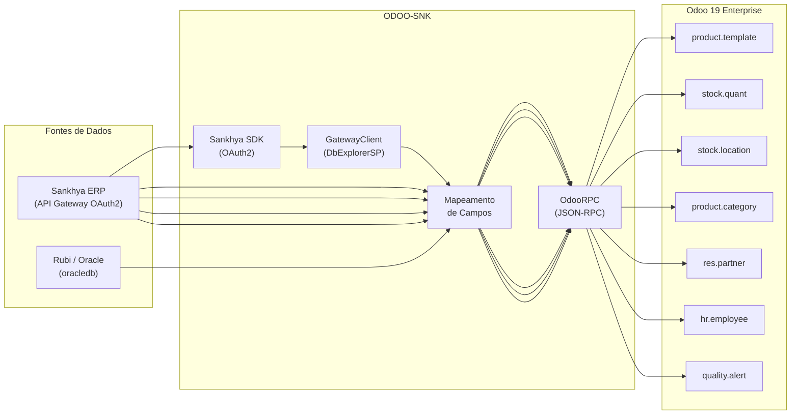

# Arquitetura — ODOO-SNK

Visao geral da arquitetura de integracao entre Sankhya, Rubi (Oracle) e Odoo 19 Enterprise.

---

## Diagrama de Fluxo



---

## Fluxo Geral de Sincronizacao

1. **Autenticacao** no Sankhya via OAuth2 (client credentials) ou conexao direta ao Oracle
2. **Execucao SQL** via `DbExplorerSP.executeQuery` (Sankhya) ou cursor Oracle (Rubi)
3. **Mapeamento** dos campos da origem para os modelos do Odoo
4. **Upsert** no Odoo — cria o registro se nao existir ou atualiza o existente

---

## Estrutura do Projeto

```
ODOO-SNK/
├── .env                               # Credenciais (NAO versionar!)
├── .env.example                       # Modelo de configuracao
├── .gitignore
├── README.md
├── requirements.txt                   # Dependencias Python
├── inspect_odoo.py                    # Inspeciona modelos/campos do Odoo
├── verificar_modulos_odoo.py          # Lista modulos instalados no Odoo
├── limpar_cache.bat                   # Limpa cache de bytecode Python
│
├── docs/                              # Documentacao do projeto
│   ├── arquitetura.md                 # Este arquivo
│   ├── quickstart.md                  # Instalacao e primeira execucao
│   ├── modulos-sincronizacao.md       # Produtos, Estoque, Parceiros
│   ├── producao.md                    # Funcionarios, qualidade, NC
│   ├── modulos-base.md               # loginOdoo e loginSNK
│   ├── troubleshooting.md            # Erros comuns e seguranca
│   └── sql-queries.md                # Personalizacao de queries SQL
│
├── loginOdoo/                         # Modulo de conexao com o Odoo
│   ├── __init__.py
│   └── conexao.py                     # OdooConfig, OdooConexao, criar_conexao()
│
├── loginSNK/                          # Modulo de conexao com o Sankhya
│   ├── __init__.py
│   ├── conexao.py                     # SankhyaConfig, SankhyaConexao (SDK OAuth2)
│   ├── dbexplorer_EXAMPLE.py          # Exemplo de uso do GatewayClient
│   └── sql/
│       ├── produtos.sql               # Query de produtos (TGFPRO)
│       ├── estoque.sql                # Query de saldo de estoque (TGFEST)
│       ├── grupos.sql                 # Query de grupos de produtos (TGFGRU)
│       ├── locais.sql                 # Query de locais de estoque (TGFLOC)
│       ├── parceiros.sql              # Query de parceiros (TGFPAR)
│       ├── parceiros_vendedor.sql     # Query de parceiros filtrada por vendedor
│       └── vendedores.sql             # Query de vendedores
│
├── Produtos/                          # Sincronizacao de Produtos e Estoque
│   ├── __init__.py
│   ├── sincronizar_produtos.py        # TGFPRO → product.template
│   ├── sincronizar_estoque.py         # TGFEST → stock.quant
│   ├── sincronizar_grupos.py          # TGFGRU → product.category
│   └── sincronizar_locais.py          # TGFLOC → stock.location
│
├── Parceiros/                         # Sincronizacao de Parceiros
│   ├── __init__.py
│   └── sincronizar_parceiros.py       # TGFPAR → res.partner
│
└── producao/                          # Scripts do setor de Producao/Qualidade
    ├── sync_funcionarios.py           # Rubi (Oracle) → hr.employee
    ├── setup_fundicao.py              # Configuracao inicial do setor de Fundicao
    ├── registrar_nc.py                # Registro interativo de nao conformidades
    ├── registro_diario_nc.py          # Registro em lote de NCs diarias
    ├── criar_alertas_nc.py            # Criacao de alertas de qualidade
    ├── limpar_alertas_genericos.py    # Remove alertas genericos duplicados
    ├── config_bom_massa.py            # Configuracao em massa de listas de materiais
    ├── verify_bom.py                  # Verifica integridade das listas de materiais
    ├── verify_sync.py                 # Verifica resultado de sincronizacoes
    ├── verify_alerts.py               # Verifica alertas de qualidade
    └── sql/                           # Queries SQL para producao
```

---

## Modelos do Odoo Utilizados

| Modelo | Descricao |
|--------|-----------|
| `product.template` | Templates de produtos |
| `product.product` | Variantes de produtos |
| `product.category` | Categorias / grupos de produtos |
| `uom.uom` | Unidades de medida |
| `stock.quant` | Saldos de estoque |
| `stock.location` | Locais de estoque |
| `stock.warehouse` | Depositos |
| `res.partner` | Clientes / Fornecedores / Parceiros |
| `res.country` | Paises |
| `res.country.state` | Estados |
| `hr.employee` | Funcionarios |
| `hr.department` | Departamentos |
| `quality.alert` | Alertas de qualidade / Nao conformidades |
| `quality.alert.team` | Equipes de qualidade |
| `quality.reason` | Motivos de nao conformidade |
| `ir.module.module` | Modulos instalados |

### Tipos de Produto (Odoo 19 API)

| Valor API | Label na UI | is_storable | Descricao |
|-----------|-------------|-------------|-----------|
| `consu` | Mercadorias | `True` | Bens tangiveis com controle de estoque |
| `service` | Servico | `False` | Ofertas intangiveis sem estoque |
| `combo` | Combo | — | Mix de bens e servicos |
